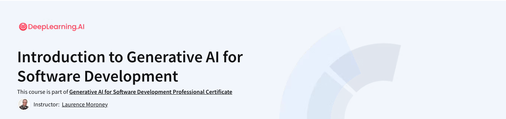

# Coursera: Generative AI for Software Development




[Course](https://www.coursera.org/professional-certificates/generative-ai-for-software-development)

## What you'll learn

- Learn how LLMs work. By knowing how machine learning systems work, you’ll be able to use them more effectively to support your work as a developer.
- Experiment quickly. Using LLMs can speed up your ability to prototype and test new features, allowing you to quickly iterate and ship your code.
- Optimize your code quality. Get to production-ready code faster by working with an LLM to find and fix bugs.
- Team up with AI on engineering tasks. Break through roadblocks and with your team by leveraging an LLM’s knowledge of development roles and tasks.

## Fabric

```sh
cat ai-and-machine-learning.txt | pbcopy
pbpaste | fabric --pattern summarize_paper > ai-and-machine-learning-summarize-paper.md
```
